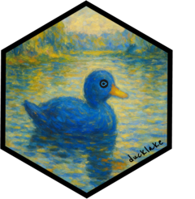

<!-- README.md is generated from README.Rmd. Please edit that file -->

```{r, include = FALSE}
knitr::opts_chunk$set(
  collapse = TRUE,
  comment = "#>",
  fig.path = "man/figures/README-",
  out.width = "100%"
)
knitr::opts_knit$set(root.dir = tempdir())
```

# ducklake <a href="https://tgerke.github.io/ducklake-r/"></a>

<!-- badges: start -->
[](https://lifecycle.r-lib.org/articles/stages.html#experimental)
[](https://github.com/tgerke/ducklake-r/actions)
[](https://codecov.io/gh/tgerke/ducklake-r)
<!-- badges: end -->

ducklake is an R package that brings versioned data lake infrastructure to data-intensive workflows. Built on [DuckDB](https://r.duckdb.org/index.html) and [DuckLake](https://ducklake.select/docs/stable/duckdb/introduction.html), it provides ACID transactions, automatic versioning, time travel queries, and complete audit trails.

## Why DuckLake?

Many industries rely on flat-file workflows (CSV, XPT, Excel, etc.) that create significant data management challenges:

- **Disconnected flat files**: Related datasets stored as separate files despite being inherently relational
- **Lost audit trails**: No automatic tracking of who changed what and when
- **Version control gaps**: Multiple dataset versions scattered across folders with unclear provenance  
- **Reproducibility issues**: Inability to recreate analyses from specific time points
- **Collaboration friction**: Multiple analysts working with different versions of the same data
- **Compliance challenges**: Difficulty demonstrating data integrity and audit trails for regulated industries

[DuckLake](https://ducklake.select/) solves these problems by implementing a **versioned data lake** architecture that:

- Preserves relational structure between related datasets
- Automatically versions every data change with timestamps and metadata
- Enables time travel to recreate analyses exactly as they were run
- Provides complete audit trails with author attribution and commit messages
- Supports layered architecture (bronze/silver/gold) for data lineage from raw to analysis-ready
- Allows multiple team members to collaborate safely with shared data

## Installation

Install the development version of ducklake with:

``` r
pak::pak("tgerke/ducklake-r")
```

## Quick example: Layered data workflow

```{r example, message=FALSE}
library(ducklake)
library(dplyr)

# Install the ducklake extension (requires DuckDB v1.3.0 or higher)
install_ducklake()

# Create a data lake in a temporary directory
attach_ducklake("my_data_lake", lake_path = tempdir())

# Bronze layer: Load raw data exactly as received
with_transaction(
  create_table(mtcars, "vehicles_raw"),
  author = "Data Engineer",
  commit_message = "Initial load of raw vehicle data"
)

# Silver layer: Apply cleaning transformations
with_transaction(
  get_ducklake_table("vehicles_raw") |>
    mutate(cyl = as.character(cyl)) |>
    create_table("vehicles_clean"),
  author = "Data Engineer", 
  commit_message = "Clean and standardize vehicle data"
)

# Gold layer: Create analysis dataset with business logic
with_transaction(
  get_ducklake_table("vehicles_clean") |>
    mutate(
      efficiency = case_when(
        mpg < 15 ~ "Low",
        mpg < 25 ~ "Medium",
        TRUE ~ "High"
      )
    ) |>
    create_table("vehicles_analysis"),
  author = "Data Analyst",
  commit_message = "Create analysis-ready dataset with efficiency categories"
)

# Update the silver layer with additional transformations
with_transaction(
  get_ducklake_table("vehicles_clean") |>
    mutate(gear = as.integer(gear)) |>
    replace_table("vehicles_clean"),
  author = "Data Engineer",
  commit_message = "Add gear type conversion to silver layer"
)

# View the analysis dataset
get_ducklake_table("vehicles_analysis") |>
  select(mpg, cyl, efficiency) |>
  head(3)

# View complete audit trail across all layers with author and commit messages
list_table_snapshots()

# Time travel: Query the silver layer as it existed at snapshot 2 (before updates)
get_ducklake_table_version("vehicles_clean", version = 2) |>
  select(mpg, cyl, gear) |>
  head(3)

# Clean up
detach_ducklake("my_data_lake")
```

## Medallion architecture

ducklake implements a layered data architecture (medallion pattern) that ensures data quality and traceability:

- **Bronze layer** (raw): Data exactly as received from source systems—preserves original data for audit trails
- **Silver layer** (cleaned): Standardized, cleaned data with transformations and validations—the trusted source for analysis
- **Gold layer** (analytics): Business-logic datasets optimized for specific analyses, dashboards, or reports

Each layer is automatically versioned, providing complete data lineage from raw source through to analysis-ready datasets. This approach enables:

- **Complete audit trail**: Original data preserved alongside all transformations
- **Reprocessability**: Reprocess from bronze if cleaning logic changes without re-extracting from source
- **Data lineage**: Clear progression from raw → cleaned → analysis-ready
- **Validation**: Compare layers to verify transformations
- **Quality assurance**: Separate concerns between ingestion, cleaning, and analysis

## Learn more

Check out the [pkgdown site](https://tgerke.github.io/ducklake-r/) for detailed vignettes:

- [Clinical Trial Data Lake](https://tgerke.github.io/ducklake-r/articles/clinical-trial-datalake.html) - **Start here**: Complete workflow from SDTM to ADaM with regulatory artifacts
- [Cookbook](https://tgerke.github.io/ducklake-r/articles/ducklake.html) - Quick recipes for common operations
- [Modifying Tables](https://tgerke.github.io/ducklake-r/articles/modifying-tables.html) - Two approaches for table modifications
- [Transactions](https://tgerke.github.io/ducklake-r/articles/transactions.html) - ACID transaction support
- [Time Travel](https://tgerke.github.io/ducklake-r/articles/time-travel.html) - Query historical data

## Key features

- **Versioned data lake**: Every data change automatically tracked with timestamps and metadata
- **Lightweight snapshots**: Create unlimited snapshots without frequent compacting steps
- **Medallion architecture**: Bronze/silver/gold layers for data lineage and quality
- **ACID transactions**: Atomic updates with concurrent access and transactional guarantees over multi-table operations
- **Time travel**: Query data exactly as it existed at any point in time—essential for reproducibility
- **Performance-oriented**: Uses Parquet columnar storage with statistics for filter pushdown, enabling fast queries on large datasets
- **Schema evolution**: Adapt table schemas over time as requirements change
- **Tidyverse interface**: Familiar dplyr syntax for data manipulation
- **Two complementary approaches**: `rows_*` functions for data.frames and pipeline functions for dplyr workflows
- **Complete audit trails**: Who changed what, when, and why—suitable for regulated industries
- **Seamless integration**: Works with duckdb, duckplyr, and the broader R ecosystem
