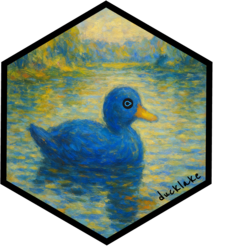

<!-- README.md is generated from README.Rmd. Please edit that file -->

# ducklake <a href="https://tgerke.github.io/ducklake-r/"></a>

<!-- badges: start -->

[](https://lifecycle.r-lib.org/articles/stages.html#experimental)
[](https://github.com/tgerke/ducklake-r/actions/workflows/R-CMD-check.yaml)
[](https://github.com/tgerke/ducklake-r/actions)
[](https://app.codecov.io/gh/tgerke/ducklake-r)
<!-- badges: end -->

ducklake is an R package that brings versioned data lake infrastructure
to data-intensive workflows. Built on
[DuckDB](https://r.duckdb.org/index.html) and
[DuckLake](https://ducklake.select/docs/stable/duckdb/introduction.html),
it provides ACID transactions, automatic versioning, time travel
queries, and complete audit trails.

## Why DuckLake?

Many industries rely on flat-file workflows (CSV, XPT, Excel, etc.) that
create significant data management challenges:

- **Disconnected flat files**: Related datasets stored as separate files
  despite being inherently relational
- **Lost audit trails**: No automatic tracking of who changed what and
  when
- **Version control gaps**: Multiple dataset versions scattered across
  folders with unclear provenance  
- **Reproducibility issues**: Inability to recreate analyses from
  specific time points
- **Collaboration friction**: Multiple analysts working with different
  versions of the same data
- **Compliance challenges**: Difficulty demonstrating data integrity and
  audit trails for regulated industries

[DuckLake](https://ducklake.select/) solves these problems by
implementing a **versioned data lake** architecture that:

- Preserves relational structure between related datasets
- Automatically versions every data change with timestamps and metadata
- Enables time travel to recreate analyses exactly as they were run
- Provides complete audit trails with author attribution and commit
  messages
- Supports layered architecture (bronze/silver/gold) for data lineage
  from raw to analysis-ready
- Allows multiple team members to collaborate safely with shared data

## Installation

``` r
install.packages("ducklake")
```

### Development version

``` r
pak::pak("tgerke/ducklake-r")
```

ducklake requires the [duckdb](https://r.duckdb.org) R package version
1.5.2 or newer: DuckDB 1.5.2 is the release that ships the stable
[DuckLake 1.0
specification](https://ducklake.select/docs/stable/specification/introduction).
The Quack remote-access features need DuckDB 1.5.3 or newer, which means
duckdb 1.5.3 or newer from CRAN.

DuckLake itself ships as a DuckDB extension that is downloaded on first
use. Run `install_ducklake()` once, or check whether you already have it
with `ducklake_extension_available()`. From duckdb 1.5.2 on, extensions
live in a per-session temporary directory unless you point
`DUCKDB_R_HOME` (for example in `~/.Renviron`) at a directory of your
choice. Do that, and the download happens once per machine instead of
once per session.

ducklake manages its own DuckDB connection, so there is nothing to set
up: just `attach_ducklake()` and go. If you prefer to supply your own
connection (for example, one shared with other DBI-based tools),
register it with `set_ducklake_connection()`.

## Quick example: Layered data workflow

``` r
library(ducklake)
library(dplyr)

# Install the ducklake extension (requires duckdb R package >= 1.5.2)
install_ducklake()

# Create a data lake in a temporary directory
attach_ducklake("my_data_lake", lake_path = tempdir())

# One schema per medallion layer, created in a single snapshot
with_transaction({
  create_schema("bronze")
  create_schema("silver")
  create_schema("gold")
}, author = "Data Engineer", commit_message = "Create medallion layers")

# Bronze layer: Load raw data exactly as received
with_transaction(
  create_table(mtcars, "bronze.vehicles"),
  author = "Data Engineer",
  commit_message = "Initial load of raw vehicle data"
)

# Silver layer: Apply cleaning transformations. The pipeline runs inside
# DuckDB and writes straight into the lake
with_transaction(
  get_ducklake_table("bronze.vehicles") |>
    mutate(cyl = as.character(cyl)) |>
    create_table("silver.vehicles"),
  author = "Data Engineer", 
  commit_message = "Clean and standardize vehicle data"
)

# Gold layer: Create analysis dataset with business logic
with_transaction(
  get_ducklake_table("silver.vehicles") |>
    mutate(
      efficiency = case_when(
        mpg < 15 ~ "Low",
        mpg < 25 ~ "Medium",
        TRUE ~ "High"
      )
    ) |>
    create_table("gold.vehicle_efficiency"),
  author = "Data Analyst",
  commit_message = "Create analysis-ready dataset with efficiency categories"
)

# Update the silver layer with additional transformations
with_transaction(
  get_ducklake_table("silver.vehicles") |>
    mutate(gear = as.integer(gear)) |>
    replace_table("silver.vehicles"),
  author = "Data Engineer",
  commit_message = "Add gear type conversion to silver layer"
)

# View the analysis dataset
get_ducklake_table("gold.vehicle_efficiency") |>
  select(mpg, cyl, efficiency) |>
  head(3)
#> # A query:  ?? x 3
#> # Database: DuckDB 1.5.5 [tgerke@Darwin 25.6.0:R 4.5.2//private/var/folders/b7/664jmq55319dcb7y4jdb39zr0000gq/T/Rtmpt7y8Lw/ducklake/ducklake623c4db47890.duckdb]
#>     mpg cyl   efficiency
#>   <dbl> <chr> <chr>     
#> 1  21   6.0   Medium    
#> 2  21   6.0   Medium    
#> 3  22.8 4.0   Medium

# View complete audit trail across all layers with author and commit messages
list_table_snapshots()
#>   snapshot_id       snapshot_time schema_version
#> 1           0 2026-09-04 23:25:48              0
#> 2           1 2026-09-04 23:25:48              1
#> 3           2 2026-09-04 23:25:48              2
#> 4           3 2026-09-04 23:25:48              3
#> 5           4 2026-09-04 23:25:48              4
#> 6           5 2026-09-04 23:25:48              5
#>                                                                       changes
#> 1                                                       schemas_created, main
#> 2                                       schemas_created, bronze, silver, gold
#> 3                    tables_created, tables_inserted_into, bronze.vehicles, 4
#> 4                    tables_created, tables_inserted_into, silver.vehicles, 5
#> 5            tables_created, tables_inserted_into, gold.vehicle_efficiency, 6
#> 6 tables_created, tables_dropped, tables_inserted_into, silver.vehicles, 5, 7
#>          author                                           commit_message
#> 1          <NA>                                                     <NA>
#> 2 Data Engineer                                  Create medallion layers
#> 3 Data Engineer                         Initial load of raw vehicle data
#> 4 Data Engineer                       Clean and standardize vehicle data
#> 5  Data Analyst Create analysis-ready dataset with efficiency categories
#> 6 Data Engineer                 Add gear type conversion to silver layer
#>   commit_extra_info
#> 1              <NA>
#> 2              <NA>
#> 3              <NA>
#> 4              <NA>
#> 5              <NA>
#> 6              <NA>

# Time travel: Query the silver layer as it existed at snapshot 3 (before updates)
get_ducklake_table_version("silver.vehicles", version = 3) |>
  select(mpg, cyl, gear) |>
  head(3)
#> # A query:  ?? x 3
#> # Database: DuckDB 1.5.5 [tgerke@Darwin 25.6.0:R 4.5.2//private/var/folders/b7/664jmq55319dcb7y4jdb39zr0000gq/T/Rtmpt7y8Lw/ducklake/ducklake623c4db47890.duckdb]
#>     mpg cyl    gear
#>   <dbl> <chr> <dbl>
#> 1  21   6.0       4
#> 2  21   6.0       4
#> 3  22.8 4.0       4

# Clean up
detach_ducklake("my_data_lake")
```

## Medallion architecture

ducklake implements a layered data architecture (medallion pattern) that
ensures data quality and traceability:

- **Bronze layer** (raw): Data exactly as received from source
  systems—preserves original data for audit trails
- **Silver layer** (cleaned): Standardized, cleaned data with
  transformations and validations—the trusted source for analysis
- **Gold layer** (analytics): Business-logic datasets optimized for
  specific analyses, dashboards, or reports

Each layer is automatically versioned, providing complete data lineage
from raw source through to analysis-ready datasets. Each layer can live
in a schema of its own (`create_schema()`), which keeps
`bronze.vehicles`, `silver.vehicles`, and `gold.vehicle_efficiency` one
lineage under three roofs, and lets access to raw data be restricted at
the schema level. This approach enables:

- **Complete audit trail**: Original data preserved alongside all
  transformations
- **Reprocessability**: Reprocess from bronze if cleaning logic changes
  without re-extracting from source
- **Data lineage**: Clear progression from raw → cleaned →
  analysis-ready
- **Validation**: Compare layers to verify transformations
- **Quality assurance**: Separate concerns between ingestion, cleaning,
  and analysis

## Column-level lineage with dplyneage

ducklake tracks lineage at the table level: which tables changed at each
snapshot, and why. For lineage *within* a query — which source columns
feed each output column — the companion package
[dplyneage](https://github.com/tgerke/dplyneage) picks up where ducklake
leaves off. Lake tables are ordinary dbplyr lazy tables, so any query
pipes straight into an interactive diagram:

``` r
library(dplyneage)

get_ducklake_table("orders") |>
  dplyr::left_join(get_ducklake_table("customers"), by = "customer_id") |>
  dplyr::group_by(region) |>
  dplyr::summarise(total_sales = sum(amount, na.rm = TRUE)) |>
  extract_lineage() |>
  lineage_flow()
```

dplyneage’s [ducklake lineage
vignette](https://tgerke.github.io/dplyneage/articles/ducklake-lineage.html)
walks through a full example, including per-layer diagrams for medallion
pipelines and lineage for time-travel queries.

## Learn more

Check out the [pkgdown site](https://tgerke.github.io/ducklake-r/) for
detailed vignettes:

- [Getting
  Started](https://tgerke.github.io/ducklake-r/articles/ducklake.html) -
  Quick recipes for common operations
- [Choosing a
  Deployment](https://tgerke.github.io/ducklake-r/articles/deployment.html) -
  Which catalog, where the data goes, who can reach it, and what to set
  up on day one
- [Clinical Trial Data
  Lake](https://tgerke.github.io/ducklake-r/articles/clinical-trial-datalake.html) -
  Complete workflow from SDTM to ADaM with regulatory artifacts
- [Modifying
  Tables](https://tgerke.github.io/ducklake-r/articles/modifying-tables.html) -
  Choosing how to change a table: joins vs. `rows_*`, upserts,
  `merge_into()`, and `replace_table()`
- [Data
  Inlining](https://tgerke.github.io/ducklake-r/articles/data-inlining.html) -
  Streaming-friendly small writes
- [Transactions](https://tgerke.github.io/ducklake-r/articles/transactions.html) -
  ACID transaction support
- [Time
  Travel](https://tgerke.github.io/ducklake-r/articles/time-travel.html) -
  Query and restore historical data
- [Storage and
  Backups](https://tgerke.github.io/ducklake-r/articles/storage-and-backups.html) -
  Back up and recover your lake
- [Visualizing Your
  Lake](https://tgerke.github.io/ducklake-r/articles/visualizing-your-lake.html) -
  Plot snapshot history, change volume, and storage layout
- [Quack Remote
  Access](https://tgerke.github.io/ducklake-r/articles/quack-remote-access.html) -
  Share a DuckLake over the network with the Quack protocol

## Key features

- **Versioned data lake**: Every data change automatically tracked with
  timestamps and metadata
- **Multi-backend catalogs**: Use DuckDB (default), PostgreSQL, SQLite,
  or MySQL as the catalog database — enables concurrent multi-client
  access with PostgreSQL or SQLite ([DuckLake 1.0
  spec](https://ducklake.select/docs/stable/specification/introduction))
- **Remote access over Quack**: Serve a DuckLake to other R sessions
  over the network and let several people read and write it at once,
  using DuckDB’s Quack protocol (requires DuckDB 1.5.3 or newer)
- **Lightweight snapshots**: Create unlimited snapshots without frequent
  compacting steps
- **Medallion architecture**: Bronze/silver/gold layers for data lineage
  and quality
- **ACID transactions**: Atomic updates with concurrent access and
  transactional guarantees over multi-table operations;
  `set_ducklake_retry()` tunes how DuckLake retries transactions that
  race with another writer
- **Time travel**: Query data exactly as it existed at any point in
  time—essential for reproducibility. Pin a whole session to a snapshot
  with `attach_ducklake(snapshot_version = ...)`
- **Performance-oriented**: Uses Parquet columnar storage with
  statistics for filter pushdown, enabling fast queries on large
  datasets. Partitioning (`set_table_partitioning()`) and sorted tables
  (`set_table_sorting()`) prune files on large tables
- **Migrate Parquet in place**: `add_data_files()` registers existing
  Parquet files with the lake without copying or rewriting them
- **Cloud storage**: Keep data files on S3, GCS, R2, or Azure —
  `create_storage_secret()` handles credentials
- **Tunable**: `set_ducklake_option()` adjusts DuckLake’s persisted
  settings (compression, file sizes, commit-message policy) at lake,
  schema, or table scope
- **Schema evolution in place**: `add_table_column()`,
  `drop_table_column()`, `rename_table_column()`, `set_column_type()`,
  and `rename_ducklake_table()` change a table’s shape as metadata-only
  operations — no data rewrite, and every earlier schema stays reachable
  through time travel
- **Variable labels survive the lake**: `create_table()` stores
  haven/labelled column labels as catalog comments and `collect()`
  restores them, so gtsummary and gt keep displaying them;
  `set_table_comment()`, `set_column_comments()`, and
  `get_table_comments()` manage documentation any client of the lake can
  read
- **Views**: `create_view()` stores a dplyr pipeline as a SQL view in
  the lake — shared logic that always reads current data;
  `list_ducklake_tables()` shows what’s there
- **Schemas**: Organize layers or studies with `create_schema()`; every
  function accepts `"schema.table"`
- **Tidyverse interface**: Familiar dplyr syntax for data manipulation
- **In-database writes**: `create_table()` and `replace_table()` run
  dplyr pipelines inside DuckDB and write the result straight into the
  lake, so derived layers never pass through R memory
- **Encryption**: Opt-in Parquet encryption with
  `attach_ducklake(encrypted = TRUE)`
- **A write style for every job**: `rows_insert()`, `rows_update()`,
  `rows_delete()`, and `rows_upsert()` for incremental changes;
  `merge_into()` for conditional merges and staging-table syncs;
  `replace_table()` pipelines for bulk rewrites — all fully versioned
- **Complete audit trails**: Who changed what, when, and why—suitable
  for regulated industries
- **Seamless integration**: Works with duckdb, DBI, dbplyr, and the
  broader tidyverse ecosystem
