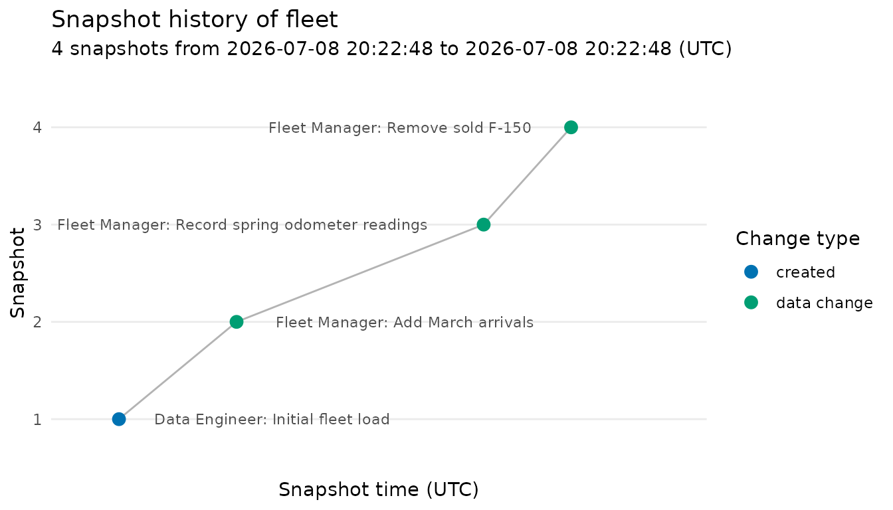
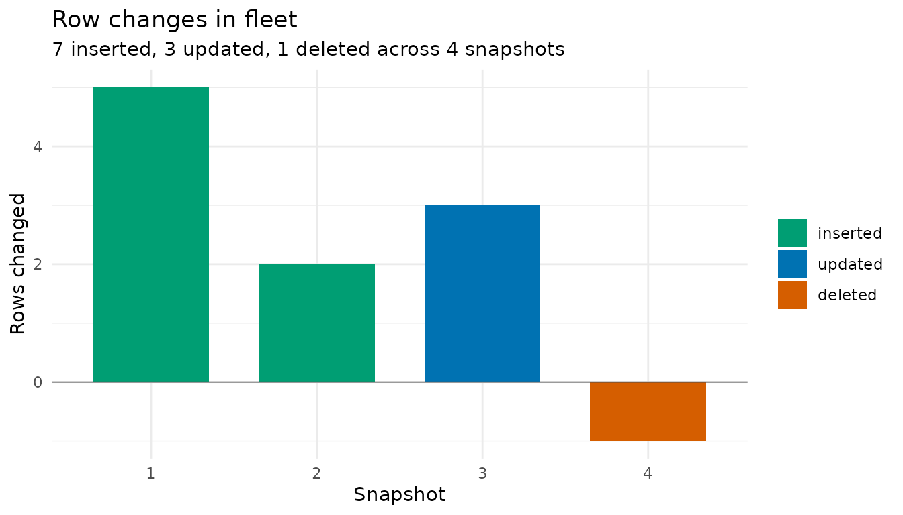
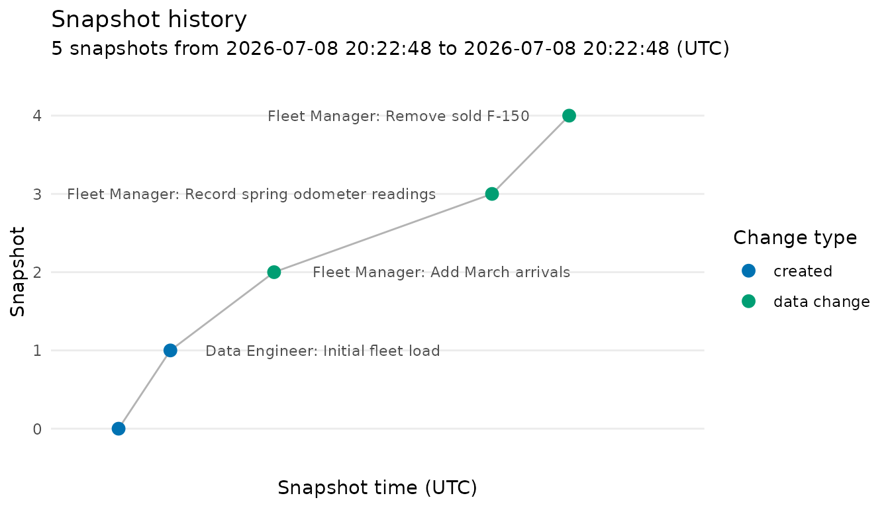
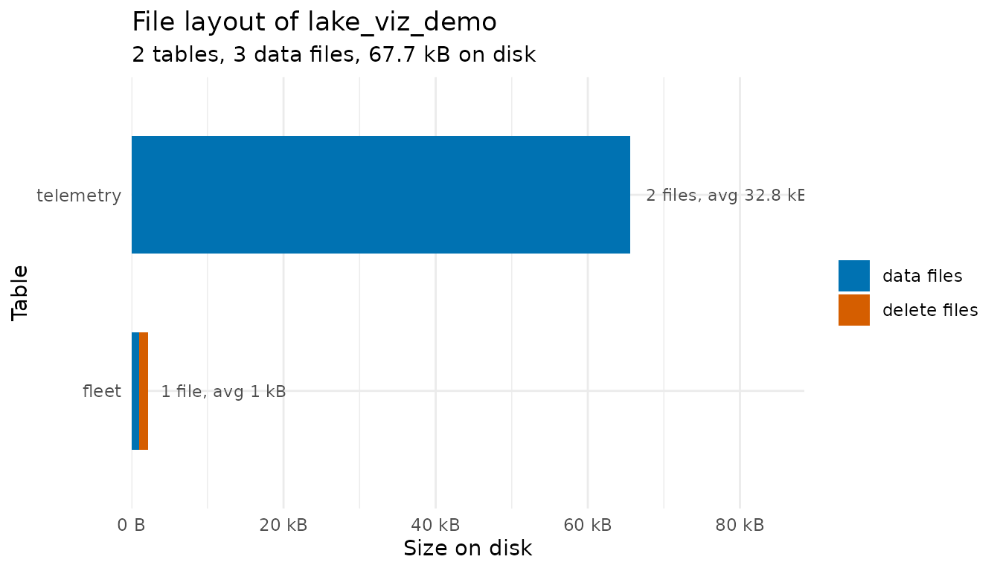
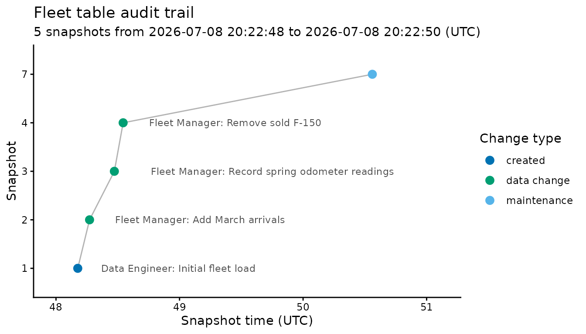

# Visualizing Your Lake

``` r

library(ducklake)
library(dplyr)
```

## Introduction

A DuckLake keeps detailed records about itself: every change to a table
is a snapshot, every changed row is in the change feed, and every
Parquet file is tracked in the catalog. All of that comes back to R as
data frames, but past a handful of rows a picture is easier to scan.
This vignette walks through the package’s three plotting functions:

- [`plot_snapshots()`](https://tgerke.github.io/ducklake-r/reference/plot_snapshots.md)
  draws a table’s history as a commit-log style timeline
- [`plot_table_changes()`](https://tgerke.github.io/ducklake-r/reference/plot_table_changes.md)
  shows how many rows each snapshot changed
- [`plot_table_files()`](https://tgerke.github.io/ducklake-r/reference/plot_table_files.md)
  shows how each table’s data is laid out on disk

These require the ggplot2 package, which is suggested (not required) by
ducklake.

## Building Some History

We’ll create a small lake and put a table through a few changes,
recording authors and commit messages along the way.

``` r

install_ducklake()
#> Installed ducklake extension.

attach_ducklake(
  ducklake_name = "lake_viz_demo",
  lake_path = vignette_temp_dir
)

fleet <- tibble(
  car_id = 1:5,
  model = c("Corolla", "Civic", "Model 3", "F-150", "Outback"),
  mileage = c(42000, 38000, 12000, 67000, 55000)
)

with_transaction(
  create_table(fleet, "fleet"),
  author = "Data Engineer",
  commit_message = "Initial fleet load"
)
#> Transaction started.
#> Transaction committed.
```

Now a couple of routine updates:

``` r

new_cars <- tibble(
  car_id = 6:7,
  model = c("CX-5", "Ioniq 5"),
  mileage = c(21000, 8000)
)

with_transaction(
  rows_insert(get_ducklake_table("fleet"), new_cars, by = "car_id"),
  author = "Fleet Manager",
  commit_message = "Add March arrivals"
)
#> Transaction started.
#> Transaction committed.

serviced <- tibble(
  car_id = c(1, 3, 5),
  mileage = c(42750, 13400, 55900)
)

with_transaction(
  rows_update(get_ducklake_table("fleet"), serviced, by = "car_id"),
  author = "Fleet Manager",
  commit_message = "Record spring odometer readings"
)
#> Transaction started.
#> Transaction committed.

sold <- tibble(car_id = 4L)

with_transaction(
  rows_delete(get_ducklake_table("fleet"), sold, by = "car_id"),
  author = "Fleet Manager",
  commit_message = "Remove sold F-150"
)
#> Transaction started.
#> Transaction committed.
```

The audit trail so far:

``` r

list_table_snapshots("fleet") |>
  select(snapshot_id, snapshot_time, author, commit_message)
#>   snapshot_id       snapshot_time        author                  commit_message
#> 1           1 2026-07-08 20:22:48 Data Engineer              Initial fleet load
#> 2           2 2026-07-08 20:22:48 Fleet Manager              Add March arrivals
#> 3           3 2026-07-08 20:22:48 Fleet Manager Record spring odometer readings
#> 4           4 2026-07-08 20:22:48 Fleet Manager               Remove sold F-150
```

## Plotting the Timeline

[`plot_snapshots()`](https://tgerke.github.io/ducklake-r/reference/plot_snapshots.md)
turns that data frame into a picture:

``` r

plot_snapshots("fleet")
```



Reading it like a git log: the newest snapshot is at the top, the
horizontal position shows when each change landed, and the color shows
whether the snapshot created the table, changed data, changed the
schema, or was maintenance activity (like flushing inlined data or
compacting files).

## How Much Changed

The timeline shows when changes happened and what kind they were;
[`plot_table_changes()`](https://tgerke.github.io/ducklake-r/reference/plot_table_changes.md)
shows how big each one was. It counts the rows each snapshot touched
using DuckLake’s change feed (the same data
[`get_table_changes()`](https://tgerke.github.io/ducklake-r/reference/get_table_changes.md)
returns) and draws them as diverging bars: rows inserted or updated
above the axis, rows deleted below it.

``` r

plot_table_changes("fleet")
```



## Plotting the Whole Lake

Calling
[`plot_snapshots()`](https://tgerke.github.io/ducklake-r/reference/plot_snapshots.md)
without a table name shows every snapshot in the lake, which is useful
for a quick health check of overall activity:

``` r

plot_snapshots()
```



## How the Data Is Stored

Behind the scenes, table data lives in Parquet files (very small writes
may be inlined into the catalog until they are flushed out). To make the
storage view interesting, let’s add a larger table alongside `fleet` and
grow it in two batches, so it ends up with two data files:

``` r

set.seed(42)

telemetry <- tibble(
  reading_id = 1:5000,
  car_id = sample(1:7, 5000, replace = TRUE),
  speed = round(runif(5000, 0, 80)),
  fuel = round(runif(5000, 0, 100))
)

create_table(telemetry, "telemetry")

more_readings <- tibble(
  reading_id = 5001:10000,
  car_id = sample(1:7, 5000, replace = TRUE),
  speed = round(runif(5000, 0, 80)),
  fuel = round(runif(5000, 0, 100))
)

rows_insert(get_ducklake_table("telemetry"), more_readings, by = "reading_id")
```

The fleet table’s handful of rows were small enough to be inlined, so we
flush them into a Parquet file to make them visible to the storage
statistics:

``` r

flush_inlined_data()
#> Flushed 10 rows from 1 table to Parquet.
#>   schema_name table_name rows_flushed
#> 1        main      fleet           10
```

[`get_table_info()`](https://tgerke.github.io/ducklake-r/reference/get_table_info.md)
reports each table’s file count and size:

``` r

get_table_info()
#>   table_name schema_id table_id                           table_uuid file_count
#> 1      fleet         0        1 019f4365-ba73-7046-ba0a-4d27d940431c          1
#> 2  telemetry         0        2 019f4365-c229-7a29-b803-8ca71074a257          2
#>   file_size_bytes delete_file_count delete_file_size_bytes
#> 1            1027                 1                   1120
#> 2           65525                 0                      0
```

And
[`plot_table_files()`](https://tgerke.github.io/ducklake-r/reference/plot_table_files.md)
draws it, with delete files (rows removed but not yet compacted away)
stacked in a second color:

``` r

plot_table_files()
```



This is the picture to watch as a lake ages: many small files or a
growing delete-file share mean it is time for the compaction tools
covered in
[`vignette("storage-and-backups")`](https://tgerke.github.io/ducklake-r/articles/storage-and-backups.md),
like
[`merge_adjacent_files()`](https://tgerke.github.io/ducklake-r/reference/merge_adjacent_files.md)
and
[`rewrite_data_files()`](https://tgerke.github.io/ducklake-r/reference/rewrite_data_files.md).

## Customizing the Plots

Each function returns a regular ggplot object, so you can restyle it
like any other plot:

``` r

plot_snapshots("fleet") +
  ggplot2::theme_classic() +
  ggplot2::labs(title = "Fleet table audit trail")
```



## Learn More

- [`vignette("time-travel")`](https://tgerke.github.io/ducklake-r/articles/time-travel.md)
  covers querying and restoring the historical versions these snapshots
  represent
- [`vignette("transactions")`](https://tgerke.github.io/ducklake-r/articles/transactions.md)
  covers recording authors and commit messages with
  [`with_transaction()`](https://tgerke.github.io/ducklake-r/reference/with_transaction.md)
  and
  [`commit_transaction()`](https://tgerke.github.io/ducklake-r/reference/commit_transaction.md)
- [`vignette("storage-and-backups")`](https://tgerke.github.io/ducklake-r/articles/storage-and-backups.md)
  covers the maintenance functions that keep the file layout healthy
